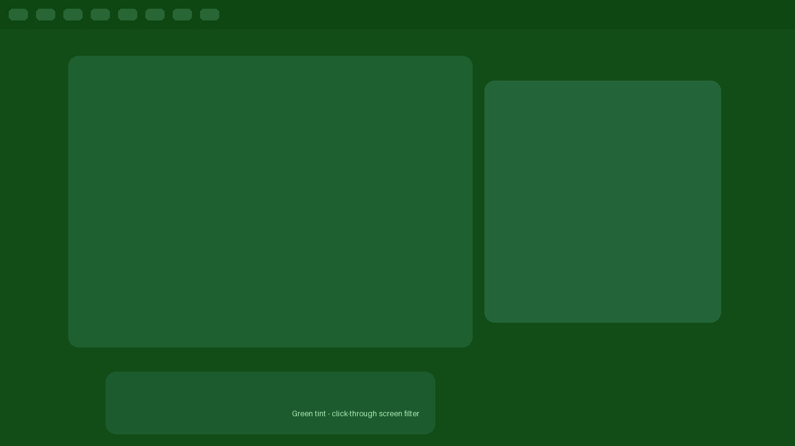

# Omatint



An [Omarchy](https://omarchy.org) plugin that tints your screen, just like a pair of
tinted "computer glasses". A chalkboard-user glyph lives in your bar: **left-click** to flip the tint
on and off, **right-click** for colour swatches, a strength slider and two switches. When it is
on, the whole screen is bathed in translucent glass — gentler contrast for long sessions, and it
never gets in the way: the tint is click-through and takes no keyboard focus, so the desktop
underneath keeps working exactly as if it were not there.


## Install

```bash
omarchy plugin add https://github.com/MrOshimaida/omarchy-omatint.git --enable
```

A chalkboard-user glyph () appears in the bar, painted in the colour you picked — dimmed while the tint is off, full strength while it is live. A status bead sits under it: grey when off, the preset colour when live. Move it around with `omarchy bar move` if you like.

## Use

- **Left-click the bar icon** — turn the tint on or off at the saved colour and strength.
- **Right-click the bar icon** — open the popup:
  - **Colour swatches** — Green, Amber, Yellow or Red (see below).
  - **Strength slider** — 5–100%, re-paints the screen live; the value is remembered.
  - **Use the night-light key** — route `Super + Ctrl + N` to this tint instead of the stock night light.
  - **Remind me to rest** — a notification every 45 minutes of continuous tint time.
- **`Super + Ctrl + N`** — toggles the tint (when the night-light-key switch is on), otherwise the
  normal Omarchy night light.

Tint it from any other keybind in `~/.config/hypr/`:

```conf
bind = SUPER, T, exec, omarchy-shell shell toggle xero.omatint '{"intensity":45,"color":"amber"}'
```

```bash
omarchy-shell shell toggle xero.omatint '{"intensity":45,"color":"red"}'
omarchy-shell shell hide  xero.omatint
```

## Colours

The four presets follow what the circadian/comfort research actually supports. The eye's
melanopsin photoreceptors — the ones that suppress melatonin — peak near **480 nm**, so what
matters for night use is how much of the 460–500 nm band a tint removes.

| Preset   | What it is for                                                                                                    |
|----------|------------------------------------------------------------------------------------------------------------------|
| `green`  | Least irritating tint. Green light is the least photophobic of the four (studied for migraine comfort), so it is the gentlest daytime wash — **not** a night filter, as 520 nm still excites melanopsin. |
| `amber`  | Evening/night filter. Warm brown-orange; the tint that best cuts the melatonin-suppressing blue band.               |
| `yellow` | Daytime contrast/glare tint. Trims deep blue; **not** a night filter (it still passes 480 nm).                      |
| `red`    | Late-night mode. ~631 nm barely excites melanopsin, so it preserves melatonin and night vision.                     |

Studies behind this: red (631 nm) preserved melatonin where blue (464 nm) suppressed it
([PMC12113466](https://pmc.ncbi.nlm.nih.gov/articles/PMC12113466/)); brown-tinted filters that cut
below ~480–500 nm reduced estimated melatonin suppression by ~99%, while lightly-tinted yellow
lenses did almost nothing ([Sci Rep 2026](https://www.nature.com/articles/s41598-025-29882-7)).
For *eye strain* itself, colour is a weak lever — a double-masked RCT and a Cochrane review found
blue-blocking lenses no better than clear ([AJO 2021](https://www.ajo.com/article/S0002-9394(21)00072-6/fulltext)),
which is why this plugin also ships a break reminder.

## Behaviour notes

- **Click-through, always.** The overlay carries an empty input region (the same trick the OSD
  uses), so it can never eat a click, drag, or scroll. It also declares no keyboard focus and no
  exclusive zone, so bindings and layouts are unaffected — a colour filter, not a modal.
- **Strength scale.** 5–100%. Even at 100% it stays translucent (45%, ~like layered sunglasses),
  so it colours the screen instead of replacing it.
- **An overlay tint is not a gamma LUT.** It looks similar to a "night light", but the overlay
  blends on top of the desktop. For true per-channel gamma control Hyprland still only offers
  temperature via `hyprsunset`; this is the simple, honest version.
- **The night-light key** is `Super + Ctrl + N`. The switch only changes what that key does at
  runtime by writing `useNightKey` into the bar entry; the stock night light is untouched when it
  is off.
- **Wiring the night-light key.** Stock Omarchy binds `Super + Ctrl + N` to the night light, so
  the plugin does not rebind it silently. Run once after installing to point that key at the
  wrapper (which reads `useNightKey` from `shell.json`):
  ```sh
  bash "$HOME/.config/omarchy/plugins/xero.omatint/bin/omatint-nightkey-install"
  ```
  Use `…/omatint-nightkey-install status` to check, and `…/omatint-nightkey-install remove` to
  restore the stock night-light binding. The install is idempotent: rerunning it just refreshes
  the managed block in `~/.config/hypr/bindings.lua`.

## Files

| File                | What it is                                          |
|---------------------|-----------------------------------------------------|
| `Omatint.qml`       | The full-screen, click-through tint layer           |
| `BarWidget.qml`     | The bar button + colour/strength/settings popup     |
| `OmatintModel.js`   | Pure logic (clamp, alpha, presets, payload); tested |
| `bin/omatint-nightkey` | Key wrapper: toggles the tint when `useNightKey` is on, else the stock night light |
| `bin/omatint-nightkey-install` | Idempotent installer/remover for the wrapper + `Super + Ctrl + N` binding |
| `test/model-test.js`| `node test/model-test.js`                           |